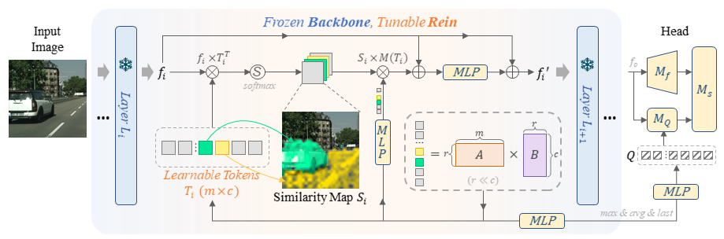
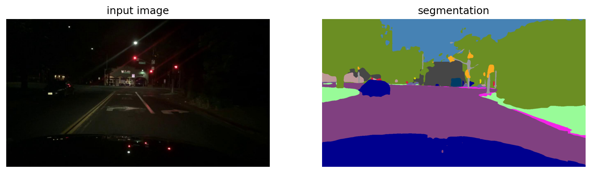

# Stronger, Fewer, & Superior: Harnessing Vision Foundation Models for Domain Generalized Semantic Segmentation
[](https://paperswithcode.com/sota/domain-adaptation-on-cityscapes-to-acdc?p=stronger-fewer-superior-harnessing-vision)

[](https://paperswithcode.com/sota/domain-generalization-on-gta-to-avg?p=stronger-fewer-superior-harnessing-vision)

[](https://paperswithcode.com/sota/domain-generalization-on-gta5-to-cityscapes?p=stronger-fewer-superior-harnessing-vision)
## Abstract
This project serves as the updated official implementation for the [paper](https://arxiv.org/pdf/2312.04265.pdf). It presents a robust fine-tuning method called **Rein**, specifically developed to effectively utilize **Vision Foundation Models (VFMs)** for **Domain Generalized Semantic Segmentation (DGSS)**. It achieves **SOTA on Cityscapes to ACDC, and GTAV to Cityscapes+Mapillary+BDD100K**.  Using only synthetic data, Rein achieved an mIoU of **78.4\% on Cityscapes** validation set!



## 🔥 News!

🔥 Rein is accepted in CVPR 2024!

🔥 Using only the data from the Cityscapes training set, we achieved an average mIoU of **77.56% on the ACDC** test set! This result ranks **first** in the DGSS methods on the ACDC [benchmark](https://acdc.vision.ee.ethz.ch/submissions/65b6848187f1a5171cf44c34)! Weight is avaliable at [release](https://github.com/w1oves/Rein/releases/tag/Cityscapes).

🔥 Using only synthetic data (UrbanSyn, GTAV, and Synthia), Rein achieved an mIoU of **78.4\% on Cityscapes**! We also attained an **average mIoU of 71.7** across Cityscapes, BDD100K, and Mapillary! Weight is avaliable at [release](https://github.com/w1oves/Rein/releases/tag/UrbanSyn%2BGTAV%2BSynthia).

## Try and Test
**Experience the demo:** Users can open [demo.ipynb](demo.ipynb) in any Jupyter-supported editor to explore our demonstration.


For testing on the cityscapes dataset, refer to the 'Install' and 'Setup' sections below.

## Environment Setup
To set up your environment, execute the following commands:
```bash
conda create -n rein -y
conda activate rein
conda install pytorch==2.0.1 torchvision==0.15.2 torchaudio==2.0.2 pytorch-cuda=11.7 -c pytorch -c nvidia -y
pip install -U openmim
mim install mmengine
mim install "mmcv>=2.0.0"
pip install "mmsegmentation>=1.0.0"
pip install "mmdet>=3.0.0"
pip install xformers=='0.0.20' # optional for DINOv2
pip install -r requirements.txt
pip install future tensorboard
```

## Dataset Preparation
**Cityscapes:** Download `leftImg8bit_trainvaltest.zip` and `gt_trainvaltest.zip` from [Cityscapes Dataset](https://www.cityscapes-dataset.com/downloads/) and extract them to `data/cityscapes`.

**Mapillary:** Download MAPILLARY v1.2 from [Mapillary Research](https://research.mapillary.com/) and extract it to `data/mapillary`.

**GTA:** Download all image and label packages from [TU Darmstadt](https://download.visinf.tu-darmstadt.de/data/from_games/) and extract them to `data/gta`.

Prepare datasets with these commands:
```shell
cd Rein
mkdir data
# Convert data for validation if preparing for the first time
python tools/convert_datasets/gta.py data/gta # Source domain
python tools/convert_datasets/cityscapes.py data/cityscapes
# Convert Mapillary to Cityscapes format and resize for validation
python tools/convert_datasets/mapillary2cityscape.py data/mapillary data/mapillary/cityscapes_trainIdLabel --train_id
python tools/convert_datasets/mapillary_resize.py data/mapillary/validation/images data/mapillary/cityscapes_trainIdLabel/val/label data/mapillary/half/val_img data/mapillary/half/val_label
```
(Optional) **ACDC**: Download all image and label packages from [ACDC](https://acdc.vision.ee.ethz.ch/) and extract them to `data/acdc`.

**Checkpoints:** Download pre-trained weights from [facebookresearch](https://dl.fbaipublicfiles.com/dinov2/dinov2_vitl14/dinov2_vitl14_pretrain.pth) for testing. Place them in the project directory without changing the file name. The final folder structure should look like this:

```
Rein
├── ...
├── checkpoints
│   ├── dinov2_vitl14_pretrain.pth
│   ├── dinov2_rein_and_head.pth
├── data
│   ├── cityscapes
│   │   ├── leftImg8bit
│   │   │   ├── train
│   │   │   ├── val
│   │   ├── gtFine
│   │   │   ├── train
│   │   │   ├── val
│   ├── bdd100k
│   │   ├── images
│   │   |   ├── 10k
│   │   │   |    ├── train
│   │   │   |    ├── val
│   │   ├── labels
│   │   |   ├── sem_seg
│   │   |   |    ├── masks
│   │   │   |    |    ├── train
│   │   │   |    |    ├── val
│   ├── mapillary
│   │   ├── training
│   │   ├── cityscapes_trainIdLabel
│   │   ├── half
│   │   │   ├── val_img
│   │   │   ├── val_label
│   ├── gta
│   │   ├── images
│   │   ├── labels
├── ...
```

## Evaluation
* Generate full weights for testing in 512x512:
  ```
  python tools/generate_full_weights.py --dinov2_segmentor_path checkpoints/dinov2_segmentor.pth --backbone checkpoints/dinov2_vitl14_pretrain.pth --rein_head checkpoints/dinov2_rein_and_head.pth
  ```
  Then, run the evaluation:
  ```
  python tools/test.py configs/dinov2/rein_dinov2_mask2former_512x512_bs1x4.py checkpoints/dinov2_segmentor.pth
  ```

* Generate full weights for testing in 1024x1024:
  ```
  python tools/generate_full_weights_1024x1024.py --dinov2_segmentor_path checkpoints/dinov2_segmentor.pth --backbone checkpoints/dinov2_vitl14_pretrain.pth --rein_head /path/to/checkpoint
  ```
  Then, run the evaluation:
  ```
  python tools/test.py configs/dinov2/rein_dinov2_mask2former_1024x1024_bs4x2.py checkpoints/dinov2_segmentor.pth
  ```

## Training
Generate converted DINOv2 weights:
```
python tools/convert_models/convert_dinov2_large_512x512.py checkpoints/dinov2_vitl14_pretrain.pth
```
Start training in single GPU:
```
python tools/train.py configs/dinov2/rein_dinov2_mask2former_512x512_bs1x4.py
```
Start training in multiple GPU:
```
PORT=12345 CUDA_VISIBLE_DEVICES=1,2,3,4 bash tools/dist_train.sh configs/dinov2/rein_dinov2_mask2former_1024x1024_bs4x2.py NUM_GPUS
```

## Citation
If you find our code or data helpful, please cite our paper:
```bibtex
@article{wei2023stronger,
  title={Stronger, Fewer, \& Superior: Harnessing Vision Foundation Models for Domain Generalized Semantic Segmentation},
  author={Wei, Zhixiang and Chen, Lin and Jin, Yi and Ma, Xiaoxiao and Liu, Tianle and Ling, Pengyang and Wang, Ben and Chen, Huaian and Zheng, Jinjin},
  journal={arXiv preprint arXiv:2312.04265},
  year={2023}
}
```
