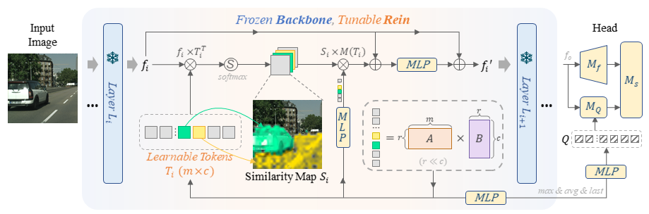
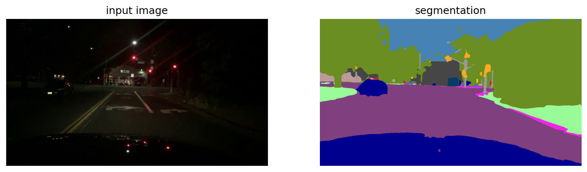

# Stronger, Fewer, & Superior: Harnessing Vision Foundation Models for Domain Generalized Semantic Segmentation

## Introduction
In this project, we introduce a robust fine-tuning approach, named **Rein**, to parameter-efficiently harness VFMs (Vision Foundation Models) for DGSS (Domain Generalized Semantic Segmentation). 
The current version is only a demo version. More detailed implementation details and training code will be released soon.


## Try and Test
**Users can directly open the [demo.ipynb](demo.ipynb) in any Jupyter-supported editor to view our demo.** 


To test on the cityscapes dataset, please follow the instructions in the 'Install' and 'Dataset and Pre-trained Models' sections.

## Install
The following Python packages are required:
- `matplotlib==3.7.1`
- `jupyter==1.0.0`
- `notebook==6.5.4`
- `Pillow==9.4.0`
- `torch==2.0.1`
- `python==3.8.16`
- `numpy==1.24.3`
- `mmengine==0.7.2`
- `mmcv==2.0.0`
- `mmdet==3.0.0`

## Dataset and Pre-trained Models
As our training does not modify the backbone parameters, the pre-trained weights can be directly downloaded from [facebookresearch](https://dl.fbaipublicfiles.com/dinov2/dinov2_vitl14/dinov2_vitl14_pretrain.pth) for testing. After downloading, please place them in the project directory without changing the file name.

The [cityscapes](https://www.cityscapes-dataset.com/) dataset is required for testing. After downloading, please place it in the project directory and name it `cityscapes`, without making any other changes.

After downloading, your directory structure should look like this:
```
.
├── cityscapes
├── dinov2_vitl14_pretrain.pth
├── head.pth
├── rein.pth
└── readme.md
```

## Citation
If you find this code or data useful, please cite our paper
```
@article{wei2023stronger,
  title={Stronger, Fewer, \& Superior: Harnessing Vision Foundation Models for Domain Generalized Semantic Segmentation},
  author={Wei, Zhixiang and Chen, Lin and Jin, Yi and Ma, Xiaoxiao and Liu, Tianle and Lin, Pengyang and Wang, Ben and Chen, Huaian and Zheng, Jinjin},
  journal={arXiv preprint arXiv:2312.04265},
  year={2023}
}
```
